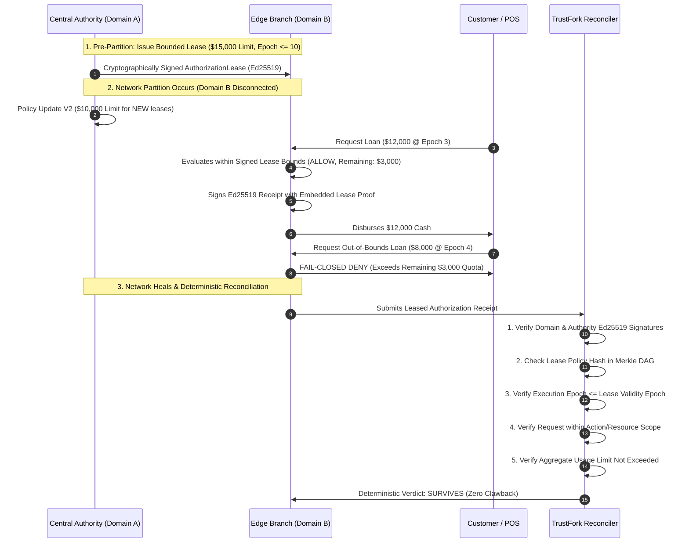

# TrustFork 🛡️

[](https://github.com/ayush2singh/Trustfork/actions/workflows/ci.yml)
[](https://www.python.org/downloads/)
[](https://opensource.org/licenses/MIT)
[](https://render.com/deploy?repo=https://github.com/ayush2singh/Trustfork)


**TrustFork** is an asynchronous, partition-tolerant, cryptographically verifiable distributed authorization engine.

It resolves the **Offline Authorization Paradox**: enabling disconnected edge nodes (e.g., regional bank branches, POS terminals, retail kiosks) to safely authorize high-value transactions during network splits while guaranteeing deterministic reconciliation and forward-recovery compensation upon reconnecting.

---

## The Distributed Dilemma

In traditional CP architectures (strict consistency), partitioned nodes must **freeze**:
* ❌ Offline branch cannot disburse loans or process withdrawals.
* ❌ Business grinds to a halt during cloud outages.

In naive AP architectures (high availability), partitioned nodes operate blindly:
* ❌ Edge branches approve loans under outdated policies.
* ❌ Reconnection creates unresolvable double-spending and ledger corruption.

**TrustFork solves this through a Pre-Authorized Bounded Lease model**:
1. Edge domains evaluate requests strictly under pre-authorized, Ed25519-signed authorization leases.
2. Every offline decision produces an RFC 8785 Ed25519 cryptographic receipt bound to the lease proof.
3. Logical vector clocks capture causal ordering without relying on NTP clocks.
4. Requests outside lease limits or validity epochs fail closed (`DENY`) immediately.
5. When the network heals, deterministic reconciliation validates the lease proof and marks compliant decisions as **`SURVIVES`** — guaranteeing permanent finality with **zero clawback, rollback, or compensation required**.

👉 **For the full trade-off analysis of all 7 core design choices, see [architecturalDecision.md](architecturalDecision.md).**

---

## Architecture & Workflow



---

## Core Technical Pillars

### 1. Bounded Authorization Leases (`lease.py`)
* **Pre-Authorized Bounded Leases**: Central Authority issues cryptographically signed leases specifying principal, action, resource, policy hash, discrete validity epoch, and usage limits before disconnection.
* **Fail-Closed Local Enforcement**: Edge nodes evaluate operations strictly against active leases. Any out-of-scope or expired request is immediately rejected (`DENY`) at the edge, guaranteeing that an unauthorized irreversible effect can never occur.

### 2. Distributed Systems: Merkle CRDT & Vector Clocks
* **Merkle Policy DAG (`merkle_crdt.py`)**: Authorization policies are modeled as content-addressed Directed Acyclic Graph (DAG) nodes. Each node hashes its rules, limits, and `parent_hash` with SHA-256. Modifications fork cleanly without silent drift.
* **Vector Clocks (`vector_clock.py`)**: Resolves Lamport logical causality. Categorizes event pairs into `HAPPENS_BEFORE`, `HAPPENS_AFTER`, `EQUAL`, or `CONCURRENT` without depending on unsynchronized hardware clocks.

### 3. Cryptographic Integrity: RFC 8785 Canonical Ed25519
* **Canonical JSON (`receipt.py`)**: Implements RFC 8785 canonical serialization (lexicographically sorted keys, no extraneous whitespace, normalized floats/integers, UTF-8).
* **Ed25519 Digital Signatures**: Every offline decision produces an unforgeable cryptographic receipt. Edge nodes cannot deny or rewrite the policy version they evaluated.

### 4. Zero-Clawback Deterministic Reconciliation (`reconciler.py`)
* **Deterministic Verification (`reconciler.py`)**: Validates the 5-point verification invariant upon reconnection. Confirmed transactions are marked **`SURVIVES`**, providing permanent finality without customer clawbacks or balance-sheet rollbacks.


---

## Evaluator Quickstart

### Prerequisites
* Python 3.12+
* [`uv`](https://docs.astral.sh/uv/) (modern, high-performance Python package manager)

```bash
# Clone the repository
git clone https://github.com/ayush2singh/Trustfork.git
cd Trustfork
```

### Option A: Run Headless Simulation (Terminal)
Executes the complete bounded lease lifecycle: pre-authorization under V1, network partition, central V2 policy update, within-lease approval ($12,000), fail-closed out-of-bounds rejection ($8,000), reconnect, and deterministic **SURVIVES** reconciliation with zero clawbacks:
```bash
python main.py
# Or via uv directly:
uv run python main.py
```

### Option B: Launch Interactive Web Dashboard
Spins up the FastAPI real-time simulation UI with interactive network topology and guided walkthrough:
```bash
uv run --directory app_build python -m uvicorn trustfork.server:app --app-dir src --port 8000 --reload
```
Open **[http://localhost:8000](http://localhost:8000)** in your browser:
* Toggle **Network Partition** on/off.
* Issue loans under pre-authorized bounded leases or test fail-closed limit rejections.
* Click **Trigger Reconciliation** to observe deterministic verification, zero-clawback **`SURVIVES`** verdicts, and Forensic Copilot audit reports.


### Option C: Run via Docker (Zero-Install)
Pull and run the prebuilt production container directly from GitHub Container Registry:
```bash
docker run -p 8000:8000 ghcr.io/ayush2singh/trustfork:latest
```

---


## Test Suite & Verification

The test suite covers all edge cases: clock concurrency, signature tampering, indefensible policies, and SQLite persistence.

```bash
uv run --directory app_build pytest
```

All **22 automated tests** pass with 0 warnings.

