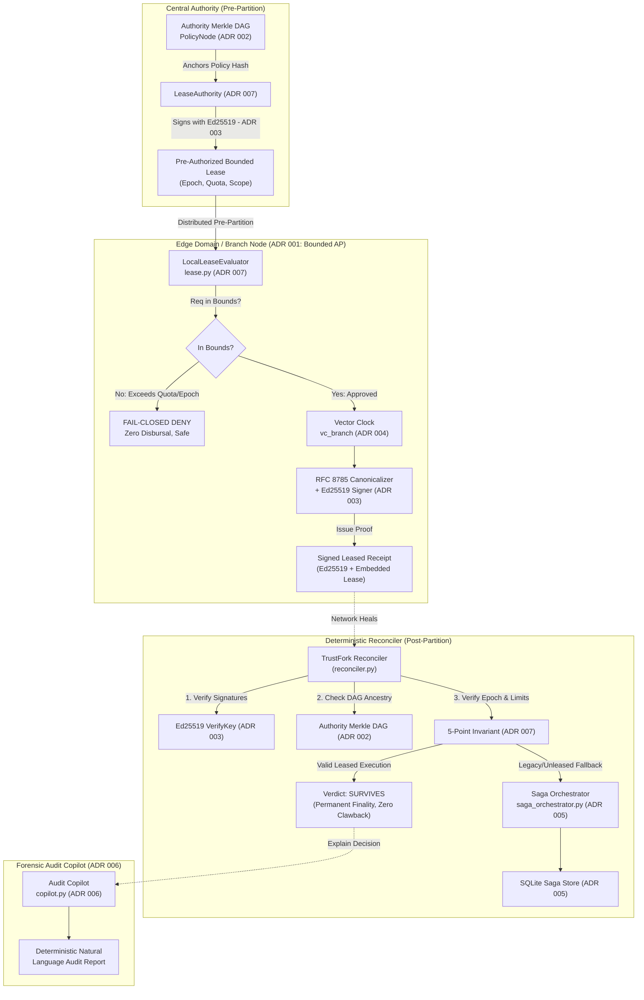

# Architectural Decision Records (ADRs) 🏛️

This document records the foundational architectural decisions made in **TrustFork**, detailing the context, decision, alternatives considered, and explicit trade-offs.

---

## System Architecture Topology

The following diagram maps each architectural decision to its corresponding runtime component:

---

## ADR 001: Choose AP with Verifiable Convergence over Strict CP (CAP Theorem)

* **Status**: Accepted
* **Context**: Regional bank branches and POS retail kiosks frequently suffer network partitions due to ISP cuts or cloud outages. In traditional CP systems (strict consistency), partitioned nodes must freeze, blocking loan disbursements and ATM withdrawals.
* **Decision**: Adopt an **AP model (Availability + Partition Tolerance)** with eventual, verifiable convergence. Allow edge nodes to authorize requests offline and sign verifiable receipts.
* **Alternatives Considered**:
  * *Strict CP (Two-Phase Commit)*: Halts offline branch operation. Unacceptable for physical business continuity.
  * *Uncoordinated AP*: Approves transactions without cryptographic proofs or causal tracking, causing irrecoverable double-spending and ledger fraud.
* **Trade-offs**:
  * ✅ **Advantage**: 100% edge availability; retail business never freezes.
  * ⚠️ **Trade-off**: The bank accepts temporary financial exposure during the partition window until reconciliation executes.

---

## ADR 002: Content-Addressed Merkle Policy DAG over Incrementing Version Counters

* **Status**: Accepted
* **Context**: Policies (e.g., maximum loan limits) change concurrently at headquarters and regional branches during network splits. Simple incrementing version counters (`v1`, `v2`, `v3`) cannot represent branching or detect concurrent divergent edits.
* **Decision**: Model authorization policies as immutable, content-addressed Directed Acyclic Graph (DAG) nodes (`PolicyNode` in `merkle_crdt.py`), where each node's SHA-256 hash commits to its rules and its `parent_hash`.
* **Alternatives Considered**:
  * *Monotonic Integers / SemVer strings*: Overwritten easily; silent configuration drift occurs when two nodes publish conflicting "v2" policies.
  * *Distributed Lock Manager (DLM / Raft)*: Requires quorum; impossible during network partitions.
* **Trade-offs**:
  * ✅ **Advantage**: Tamper-proof policy immutability; automatic fork detection; complete audit trail.
  * ⚠️ **Trade-off**: Slightly higher storage and hashing overhead compared to a single integer row in a SQL table.

---

## ADR 003: RFC 8785 Canonical JSON + Ed25519 Signatures over Standard JSON / RSA

* **Status**: Accepted
* **Context**: Offline receipts must provide non-repudiation: branches cannot deny the policy they evaluated. Standard JSON serialization varies by whitespace and key order across platforms, causing signature verification to break.
* **Decision**: Enforce RFC 8785 JSON Canonicalization Rules (lexicographically sorted keys, no whitespace, exact numeric formatting) and sign payloads with Ed25519 (`ReceiptSigner` in `receipt.py`).
* **Alternatives Considered**:
  * *Standard `json.dumps()`*: Non-deterministic across Python versions and other languages; subtle key re-orderings invalidate signatures.
  * *RSA-2048 / RSA-4096*: Massive signature sizes (256-512 bytes) and slow signing/verification speeds on edge hardware.
* **Trade-offs**:
  * ✅ **Advantage**: Fast signing/verification (<1ms), compact 64-byte signatures, byte-level interoperability across languages.
  * ⚠️ **Trade-off**: Requires strict canonical serialization overhead before signing or hashing.

---

## ADR 004: Lamport Vector Clocks over Physical Wall-Clock Timestamps (NTP)

* **Status**: Accepted
* **Context**: When reconciling offline events, determining whether an edge approval occurred before, after, or concurrently with a central policy change is vital.
* **Decision**: Use Vector Clocks (`vector_clock.py`) to model logical causality, categorizing event pairs into `HAPPENS_BEFORE`, `HAPPENS_AFTER`, `EQUAL`, or `CONCURRENT`.
* **Alternatives Considered**:
  * *System Timestamps (`time.time()`)*: Highly vulnerable to NTP drift, clock skew, manual clock tampering, and leap seconds.
  * *TrueTime (Google Spanner / GPS atomic clocks)*: Requires proprietary, specialized hardware unavailable on ordinary edge nodes.
* **Trade-offs**:
  * ✅ **Advantage**: 100% mathematically deterministic causal ordering; completely immune to clock skew or NTP desynchronization.
  * ⚠️ **Trade-off**: Vector clock size grows linearly with the number of participating nodes ($O(N)$).

---

## ADR 005: Saga Forward-Recovery with SQLite Idempotency over ACID Database Rollbacks

* **Status**: Accepted
* **Context**: In physical business systems (banking, retail, logistics), real-world actions cannot be undone via database `ROLLBACK`. When Branch B hands out physical cash to a customer offline under a policy that diverged from central authority, the money has physically left the premises.
* **Decision**: Implement the **Saga Pattern** (`saga_orchestrator.py`, `saga_store.py`) to execute forward-recovery compensating actions (e.g. `clawback`, `hold`, `overdraft_charge`) persisted idempotently in SQLite.
* **Alternatives Considered**:
  * *Two-Phase Commit (2PC)*: Blocks indefinitely during network partitions; fails availability.
  * *Pessimistic Locking*: Requires live cluster connectivity; impossible when disconnected.
* **Trade-offs**:
  * ✅ **Advantage**: Matches physical reality; idempotent execution prevents double-compensation; non-blocking recovery.
  * ⚠️ **Trade-off**: Requires explicit compensation logic for every business action; eventual consistency window exists until compensation completes.
* **Evolution to ADR 007**: While Sagas remain an essential architectural fallback for un-leased legacy actions or uncoordinated failures, TrustFork's primary paradigm now uses **Pre-Authorized Bounded Leases (ADR 007)** to prevent unauthorized divergence upfront, making compensation unnecessary for compliant leased transactions.

---

## ADR 006: Deterministic Semantic Natural Language Generation over Probabilistic Cloud LLMs

* **Status**: Accepted
* **Context**: Financial auditors, compliance officers, and evaluators require human-readable post-mortems explaining why offline decisions were committed or compensated. Relying on external cloud LLM APIs (e.g. OpenAI GPT-4, Google Gemini) introduces network latency, rate limits, recurring costs, authentication failures (missing API keys during evaluation), and non-deterministic hallucinations.
* **Decision**: Implement a **Deterministic Semantic Natural Language Generation Engine** (`copilot.py`) that extracts ground-truth mathematical facts from the Merkle DAG, Vector Clocks, and SQLite Saga records, synthesizing structured natural-language audit reports via rule-based semantic translation.
* **Alternatives Considered**:
  * *Cloud LLM API (OpenAI / Gemini)*: High risk of runtime crashes (`401 Unauthorized`) if evaluators run the repo without API keys; probabilistic responses lack mathematical consistency; vulnerable to prompt injection in transaction descriptions.
  * *Embedded Small Language Model (SLM / Llama.cpp)*: High RAM/CPU footprint (~4GB+), slow inference on edge hardware, and retains probabilistic non-determinism.
* **Trade-offs**:
  * ✅ **Advantage**: 100% mathematically faithful to ground truth; zero hallucinations; sub-millisecond execution; completely offline-safe with zero API keys or external dependencies.
  * ⚠️ **Trade-off**: Template-bound semantic phrasing; lacks the open-domain conversational flexibility of multi-billion parameter neural networks.

---

## ADR 007: Pre-Authorized Bounded Authorization Leases over Retroactive Clawbacks

* **Status**: Accepted
* **Context**: Real-world evaluators and banking compliance officers highlighted that unilateral retroactive "clawbacks" fail when disbursed funds are withdrawn or depleted, and unilateral account debits breach consumer protection regulations (e.g. CFPB, TILA).
* **Decision**: Introduce **Pre-Authorized Bounded Authorization Leases** (`lease.py`, `reconciler.py`). Before a partition occurs, Central Authority issues an Ed25519 cryptographically signed lease defining the authorized principal, action, resource, policy hash, discrete validity epoch, and usage quota. During a partition, edge domains evaluate requests strictly within active lease bounds and fail closed (`DENY`) for any out-of-bounds attempt. Reconciler deterministically verifies the lease cryptographic proof upon reconnection, marking compliant executions as **`SURVIVES`** with permanent finality and **zero clawback or compensation required**.
* **Alternatives Considered**:
  * *Unbounded Optimistic Approval with Retroactive Clawback*: Fails when funds are depleted, creates unauthorized overdrafts, and triggers consumer regulatory violations.
  * *Global 2PC / Synchronous Locking*: Destroys availability during partitions.
* **Trade-offs**:
  * ✅ **Advantage**: Completely eliminates retroactive clawbacks and rollbacks; guarantees that every offline action remains legally and technically defensible; local evaluation fails closed safely.
  * ⚠️ **Trade-off**: Requires periodic lease renewal from Central Authority before validity epochs expire; offline operations are strictly bounded by pre-allocated usage limits.

### The 5-Point Verification Invariant (`reconciler.py`)

Upon network reconnection, the deterministic reconciler subjects every submitted transaction receipt to a strict **5-Point Invariant Gate**. Permanent finality (**`SURVIVES`**) is granted if and only if all 5 points evaluate to `True`:

$$\text{Finality Verdict} = \text{SURVIVES} \iff (\text{Point}_1 \land \text{Point}_2 \land \text{Point}_3 \land \text{Point}_4 \land \text{Point}_5)$$

1. **Point 1: Cryptographic Authenticity (`lease.verify_signature`)**
   * *Invariant*: Central Authority's Ed25519 digital signature over the RFC 8785 canonical lease bytes must be valid.
   * *Failure Mode*: Immediate hard rejection (`REJECTED_SIGNATURE`). Prevents forged leases or tampered parameters.
2. **Point 2: Policy Provenance (`dag.get_policy(policy_hash)`)**
   * *Invariant*: The lease's `policy_hash` must resolve to an authentic historical node in the cluster's Merkle Policy DAG.
   * *Failure Mode*: Immediate hard rejection (`REJECTED_INDEFENSIBLE`). Prevents edge branches from executing un-anchored or fabricated rules.
3. **Point 3: Temporal Boundary (`exec_epoch <= lease.valid_until_epoch`)**
   * *Invariant*: The logical execution epoch at the edge must not exceed the pre-authorized lease expiry epoch.
   * *Failure Mode*: Rejection outside lease (`REJECTED_OUTSIDE_LEASE`). Prevents stale execution after lease expiration.
4. **Point 4: Scope Authorization (`req.action == lease.action` and `req.resource == lease.resource`)**
   * *Invariant*: The executed operation must strictly match the permitted action and target resource domain.
   * *Failure Mode*: Rejection outside lease (`REJECTED_OUTSIDE_LEASE`). Prevents privilege escalation (e.g. using a loan lease for administrative wires).
5. **Point 5: Financial Quota Boundary (`cumulative_usage + amount <= lease.usage_limit`)**
   * *Invariant*: The transaction amount combined with aggregate branch usage must not exceed the pre-authorized monetary quota.
   * *Failure Mode*: Rejection outside lease (`REJECTED_OUTSIDE_LEASE`). Prevents overdrafts, over-spending, and double-disbursals.

#### Invariant Breach Handling:
* **Prevention at Edge**: During a partition, `LocalLeaseEvaluator` checks Points 3, 4, and 5 locally, failing closed (`DENY`) to ensure $0.00 leaves the vault for invalid requests.
* **Fallback at Central**: If un-leased, divergent, or out-of-bounds transactions reach Central, the system bypasses `SURVIVES` and routes the record to the **Saga Orchestrator (ADR 005)** for asynchronous compensating forward-recovery (`COMPENSATION_DISPATCHED`).

